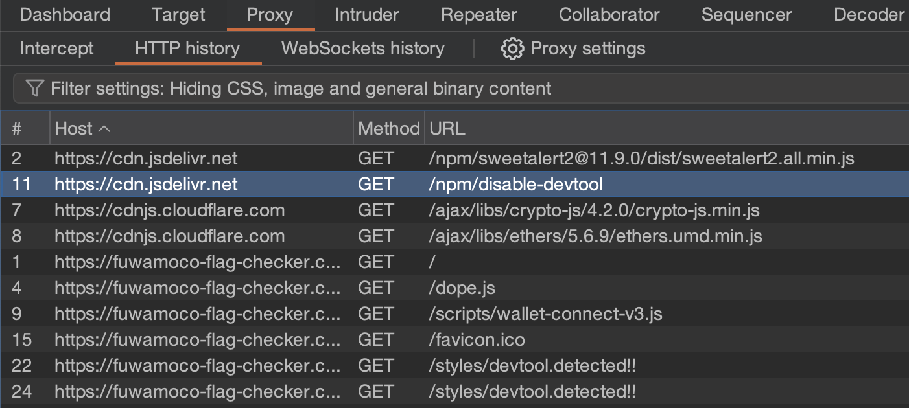
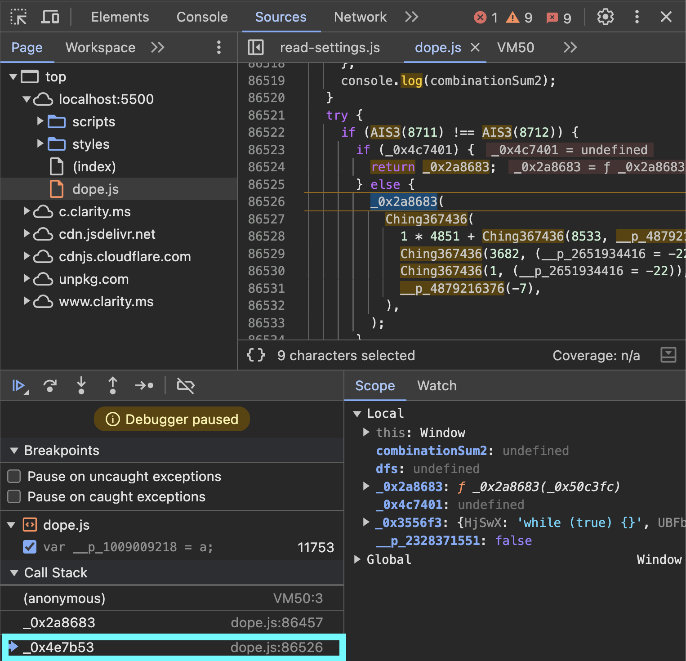

# Frontend Unraveling Web Application: Master Obfuscated Code Odyssey

- Category: Web / Reverse
- Solves: 
  - All: 3 / 253 (score > 100)

## Description

Welcome to FUWAMOCO, a journey through the labyrinth of modern web development and security practices. This challenge is not for the faint of heart; it is a voyage into the depths of a state-of-the-art, real-world web application that embodies the zenith of obfuscation and anti-debugging techniques. Your mission, should you choose to accept it, is to unravel the secrets hidden within and capture the elusive flag.

https://fuwamoco-flag-checker.ching367436.me/

> This challenge is based on a real-world crypto scam website.

## Solution

### Anti-debugging

Enter the website and open the dev tools. Observe that some anti-debugging mechanisms are in place. Observe that the main script is [/dope.js](https://fuwamoco-flag-checker.ching367436.me/dope.js). Download all of the files from that domain to debug them locally. 

```html
<script src="dope.js">
```

We can find that the script loads https://cdn.jsdelivr.net/npm/disable-devtool from the HTTP history. If we search for the documentation of it, we can see that to use it, one needs to invoke the DisableDevtool() function. If we search for the DisableDevtool() string in dope.js, we can find it at line 75236. Commenting it out should make it ineffective. By the way, if you try to drop the request to https://cdn.jsdelivr.net/npm/disable-devtool, it will keep trying until `disable-devtool` is loaded.



If we open the dev tools again, we will be paused by a breakpoint. If we inspect the call stack, we see that the `_0x2a8683` function at line 86526 does this. Commenting it out will solve the problem.



### Check Flag

After removing the anti-debugger mechanisms, we can start debugging the app! (Though there is still an anti-debugger mechanism left, that won't be triggered in our case.)

Let's first examine the click event listeners of the `Check!` button. There are three event listeners in place. One of them is Vue.js so that it might be a Vue app.


If we search for `Vue` inside dope.js, we can find it at line 86,323. If we pretty-print the script and set a breakpoint inside the `checkFlag` function, then click `Check!`, the breakpoint will be hit. The function first sets `window['Ching367436_flag'] = this['flag']`, then sleeps for a while. Finally, it checks if `window[_0x4a344c(0x19c)]` is true. If so, it will output `Good job!`, which indicates the flag is correct. `window[_0x4a344c(0x19c)]` is `window["Ching367436_flag_correct"]` (We can get this by evaluating `_0x4a344c(0x19c)` in the console). Therefore, there must be somewhere else that sets this variable.


We can hook the set function of `window["Ching367436_flag_correct"]` using the code below. It will pause when `window["Ching367436_flag_correct"]` is set. Alternatively, we can add a timer event listener breakpoint since the function that sets `window["Ching367436_flag_correct"]` is invoked by the `setInterval` event. The process of adding a timer event listener breakpoint is shown in the lower right part of the image below.

```javascript
Object.defineProperty(window, 'Ching367436_flag_correct', {
  set(newValue) {
    debugger
  },
});
```

If you choose to hook the set function and then unpause the debugger, our hook will be hit. We can check the call stack and find that the `_0x4e3653` function sets `window["Ching367436_flag_correct"]`. Let's examine the function.


If we click on the `_0x4e3653` function in the call stack, we can find the flag inside.


